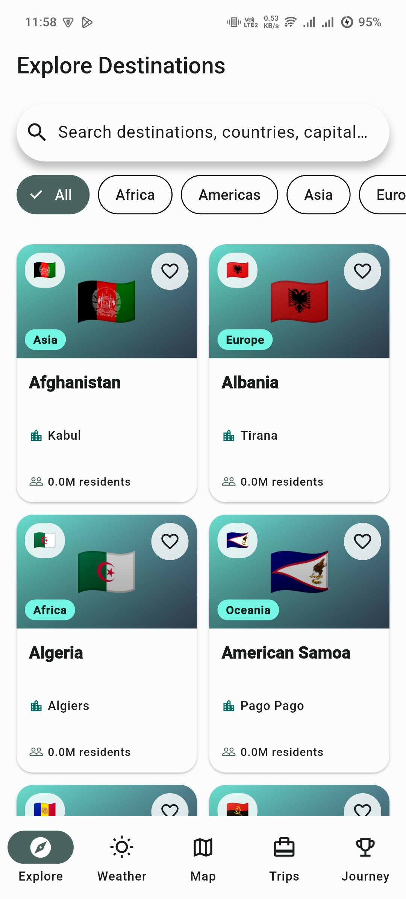
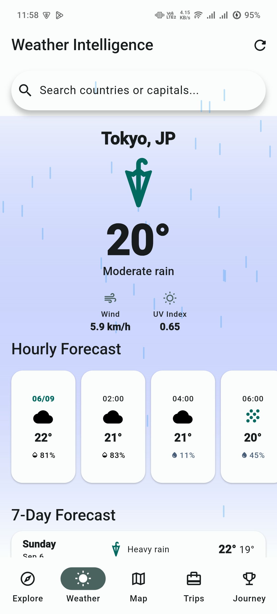
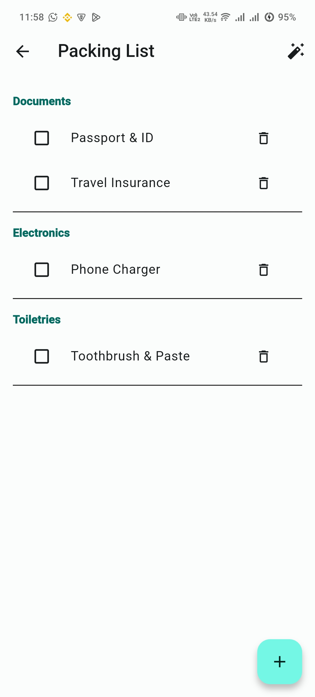
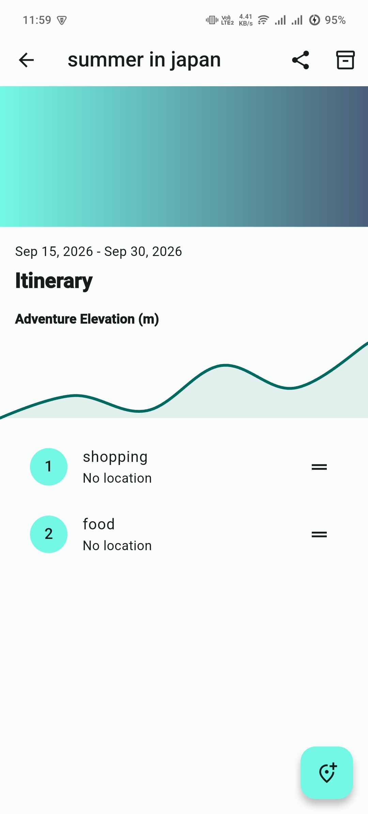

# OpenTrail 🗺️✨

[](https://flutter.dev)
[](https://dart.dev)
[](LICENSE)
[](CONTRIBUTING.md)

> **Your Offline-First Travel Intelligence Companion.** Built with a UI/UX-first philosophy, OpenTrail is a feature-rich application that empowers travelers to explore, plan, and share their journeys with 100% on-device privacy and open data intelligence.

---

## 🌟 Highlights & Core Features

### 🌍 Destination Intelligence
- **250+ Global Destinations**: In-depth data on nearly every country and territory.
- **Wikipedia Integration**: Cultural summaries and landmark photo galleries fetched and cached for offline reading.
- **Country Insights**: Instant access to local currencies, official languages, population stats, and timezones.

### 🌤️ Live Weather Engine
- **Dynamic 7-Day Forecasts**: Real-time weather curves powered by Open-Meteo.
- **Animated Iconography**: Condition-aware animations (Rotating Sun, Pulsing Moon, Drifting Clouds, Bouncing Rain).
- **Smart Hourly Intervals**: Optimized 2-hour timeline for a cleaner overview of your day.
- **Weather Search**: Search any city or capital globally to check its local forecast.

### 🗺️ Interactive & Offline Mapping
- **OpenStreetMap Integration**: High-performance vector tile rendering for fluid exploration.
- **POI Discovery**: Discover cafes, museums, transit hubs, and landmarks via Nominatim.
- **Place Detail Sheets**: Tapping any marker opens a detailed information sheet with address and type classification.

### 📝 Itinerary & Trip Planner
- **Persistent Storage**: All trips are saved locally in a high-performance **Drift SQLite** database.
- **Drag-and-Drop Activities**: Fluidly reorder your daily activities with instant database synchronization.
- **Elevation Profiles**: Import GPX route files to visualize hiking trails with interactive elevation charts.

### 🧳 Smart Utilities
- **Weather-Aware Packing**: Automatically generates gear suggestions (like rain jackets or sunscreen) based on your destination's forecast.
- **Travel Journey Stats**: Track your progress with a "Countries Visited" counter and persistent trip archives.
- **Achievements**: Unlock unique badges as you explore the world and save new memories.

### 🛡️ Ecosystem & Privacy
- **Encrypted QR Sharing**: Share entire trip itineraries peer-to-peer using AES-256 encrypted QR codes. No cloud required.
- **100% Offline-First**: Stale-while-revalidate architecture ensures you never lose access to your plans, even in zero-connectivity areas.
- **Zero-Secret Policy**: No mandatory accounts, no tracking, and no cloud data harvesting.

---

## 📸 Visual Preview & Demo

### 📺 Video Demonstration
[](https://youtube.com/shorts/9rkj5nQ8Cw0)

### 📱 App Gallery
| | | |
|:---:|:---:|:---:|
|  |  |  |
|  |  |  |
|  |  |  |

---

## 🏗️ Architecture Overview

OpenTrail enforces a **Feature-First MVVM Architecture** paired with the **Repository Pattern** and **Unidirectional Data Flow**.

```
┌─────────────────────────────────────────────────────────────┐
│                       Presentation                          │
│               Widgets & Views  <───>  ViewModels            │
│          (Stateless UI Reacting to Riverpod Notifiers)      │
└──────────────────────────────┬──────────────────────────────┘
                               │ Reads / Emits State
                               ▼
┌─────────────────────────────────────────────────────────────┐
│                        Repositories                         │
│     (Single Source of Truth & Offline Sync Strategy)         │
└──────────────────────────────┬──────────────────────────────┘
                               │
            ┌──────────────────┴──────────────────┐
            ▼                                     ▼
┌───────────────────────────────┐   ┌──────────────────────────┐
│        Remote Services        │   │      Local Database      │
│ (Dio REST APIs: Open-Meteo,   │   │  (Drift SQL Persistence, │
│  Wikimedia, OpenStreetMap)    │   │      SQLite Migrations)  │
└───────────────────────────────┘   └──────────────────────────┘
```

### Key Architectural Tenets
1. **Feature Isolation**: Standalone feature modules (`explore`, `weather`, `map`, `trips`, `journey`).
2. **Reactive Persistence**: Drift streams ensure the UI updates instantly when the database changes.
3. **Strong Result Types**: Methods return sealed `Result<S, E>` monads for exhaustive compile-time error handling.
4. **Performance Optimized**: Repaint boundaries and intelligent image caching for 120 FPS rendering.

---

## 🧰 Technology Stack

| Domain | Technology / Library | Reason |
| :--- | :--- | :--- |
| **Framework** | [Flutter 3.47.2](https://flutter.dev) | Cross-platform UI engine |
| **Persistence** | [Drift (SQLite)](https://drift.simonbinder.eu) | Reactive, type-safe relational storage |
| **State Management** | [Riverpod 2.x](https://riverpod.dev) | Compile-safe Dependency Injection & State |
| **Maps** | [Flutter Map (OSM)](https://pub.dev/packages/flutter_map) | Interactive OpenStreetMap rendering |
| **Networking** | [Dio](https://pub.dev/packages/dio) | Interceptors, retries, and cancellation |
| **Sharing** | [Encrypt (AES)](https://pub.dev/packages/encrypt) | Secure peer-to-peer trip transfer |
| **Visualization** | [FL Chart](https://pub.dev/packages/fl_chart) | Interactive elevation and climate profiles |
| **Performance** | `cached_network_image` | Low-bandwidth destination photo caching |

---

## 🚀 Getting Started

### Prerequisites
- [Flutter SDK](https://docs.flutter.dev/get-started/install) (`3.47.2` or compatible 3.x release)
- [Dart SDK](https://dart.dev/get-dart) (`3.13.2` or higher)

### Installation & Setup

1. **Clone the repository**:
   ```bash
   git clone https://github.com/imrankhalid001/opentrail.git
   cd opentrail
   ```

2. **Install dependencies**:
   ```bash
   flutter pub get
   ```

3. **Generate local code (Drift & Freezed)**:
   ```bash
   dart run build_runner build --delete-conflicting-outputs
   ```

4. **Verify static analysis & run tests**:
   ```bash
   flutter analyze
   flutter test
   ```

5. **Run the application**:
   ```bash
   flutter run
   ```

---

## 🗺️ Completed Roadmap

- [x] **Phase 0 — Project Foundation**: Feature-first MVVM, Design System tokens, and architecture rules.
- [x] **Milestone 1 — Destination Intelligence**: 250+ country dataset, Wikipedia enrichment, and search.
- [x] **Milestone 2 — Live Weather Engine**: Animated icons, 24h timeline, and city-search integration.
- [x] **Milestone 3 — Interactive Maps**: OpenStreetMap marker layers and POI discovery.
- [x] **Milestone 4 — Persistence & Itineraries**: Drift SQLite core, drag-and-drop activities, and trip dashboard.
- [x] **Milestone 5 — Advanced Travel Utilities**: Smart packing generator, achievement badges, and travel stats.
- [x] **Milestone 6 — Ecosystem & Sharing**: Encrypted QR export/import, GPX route parsing, and haptic feedback.

---

## 🤝 Contributing

We welcome contributions from the open-source community! Please review our [Contribution Guidelines](CONTRIBUTING.md) and [Code of Conduct](CODE_OF_CONDUCT.md) before submitting pull requests.

For AI Coding Agents operating on this project, please strictly follow the authoritative rules detailed in [GEMINI.md](GEMINI.md).

---

## 📄 License

OpenTrail is released under the [MIT License](LICENSE).
